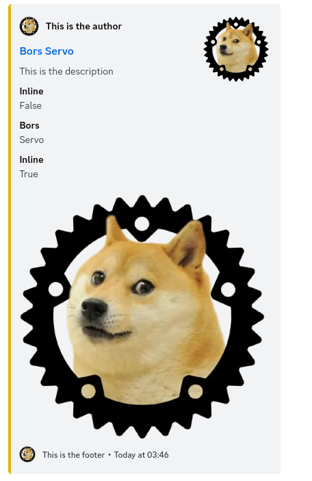

.. _messages:

Messages
========

Messages are a container for one of either textual content, embedded content, or file attachments.
They are the most base unit of arbitrary communication with a Discord bot, and most bot code deals
with receiving and sending messages.

.. autoclass:: chiru.models.message.RawMessage

.. autoclass:: chiru.models.message.Message

Sending Messages
----------------

Messages are exclusively sent to :class:`.TextualChannel` instances. Textual channels are either
guild textual channels, or direct message textual channels (they are *not* directly to users; DM
channels have an entirely separate existence from users.)

Textual messages are sent by simply passing the ``content`` parameter to 
:func:`.TextualChannel.send_message` and can use a *limited subset* of Markdown. 

Embedded Content
~~~~~~~~~~~~~~~~

Embedded content is rich, structured content that can be laid out in a way specified by the bot 
user. It's similar to the messages you get when you paste a link, but you have full control over it.
Embeds are created with the usage of :class:`.Embed`, a mutable object with various wrapper class
fields that can be assigned to. For example, the following code will produce the following embed
output:

.. code-block:: python

    embed = Embed()
    embed.author = EmbedAuthor(
        name="This is the author", 
        url="https://github.com/bors-servo", 
        icon_url="https://avatars.githubusercontent.com/u/4368172?v=4"
    )
    embed.colour = 0xE1_B3_03
    embed.description = "This is the description"
    embed.fields.append(EmbedField(name="Inline", value="False", inline=False))
    embed.fields.append(EmbedField(name="Bors", value="Servo", inline=True))
    embed.fields.append(EmbedField(name="Inline", value="True", inline=True))
    embed.footer = EmbedFooter(
        text="This is the footer", 
        icon_url="https://avatars.githubusercontent.com/u/4368172?v=4"
    )
    embed.image = EmbedImage(url="https://avatars.githubusercontent.com/u/4368172?v=4")
    embed.thumbnail = EmbedImage(url="https://avatars.githubusercontent.com/u/4368172?v=4")
    embed.timestamp = arrow.now()
    embed.title = "Bors Servo"
    embed.url = "https://github.com/bors-servo"

    await evt.channel.send_message(embed=embed)

.. autoclass:: chiru.models.embed.Embed

.. _allowed-mentions:

Controlling Mentions
--------------------

Sometimes, trickster users might try to get your bot to echo something you really don't want,
like an ``@everyone`` mention or pinging somebody repeatedly. Discord offers a feature called
*allowed mentions* that controls on a per-message basis if a user, role, or the special 
everyone/here mentions can be used.

Chiru exposes this functionality through :func:`.make_allowed_mentions`, a function that takes
in keyword arguments for the types of mentions you wish to allow in a message and produces an 
opaque type that can be passed to the message sending functionality.

.. autofunction:: chiru.mentions.make_allowed_mentions

Receiving Messages
------------------

Whilst older messages can be retrieved with the methods on :class:`.TextualChannel`, incoming
messages are received via gateway events. 

New Messages
~~~~~~~~~~~~

New messages are received on the :class:`.MessageCreate` event.

.. autoclass:: chiru.event.model.MessageCreate

.. code-block:: python

    logger = structlog.get_logger()

    async def log_message(ctx: EventContext, event: MessageCreate) -> None:
        logger.info(
            "Received message", 
            shard_id=ctx.shard_id, 
            content=event.message.content, 
            channel=event.channel.id,
            sender=event.message.author.id,
        )

    dispatcher.add_event_handler(MessageCreate, event)

Updated Messages
~~~~~~~~~~~~~~~~

Edited messages (or messages that are otherwise updated) are received via the 
:class:`.MessageUpdate` event.

.. autoclass:: chiru.event.model.MessageUpdate

.. code-block:: python

    async def name_n_shame(ctx: EventContext, event: MessageUpdate) -> None:
        await event.channel.send_message(f"Uh oh! User <@{event.message.author.id}> made a typo!")
    
    dispatcher.add_event_handler(MessageUpdate, name_n_shame)

.. warning::

    Chiru does not cache messages in any form. The original message will be lost to the sands of
    time if you don't make an effort to store it yourself.

Deleted Messages
~~~~~~~~~~~~~~~~

Messages that are deleted are received with either the :class:`.MessageDelete` event, or the
:class:`.MessageBulkDelete` event. The former is used for single message deletes, whereas the latter
is used exclusively for bulk deletes 

.. autoclass:: chiru.event.model.MessageDelete

.. autoclass:: chiru.event.model.MessageBulkDelete
